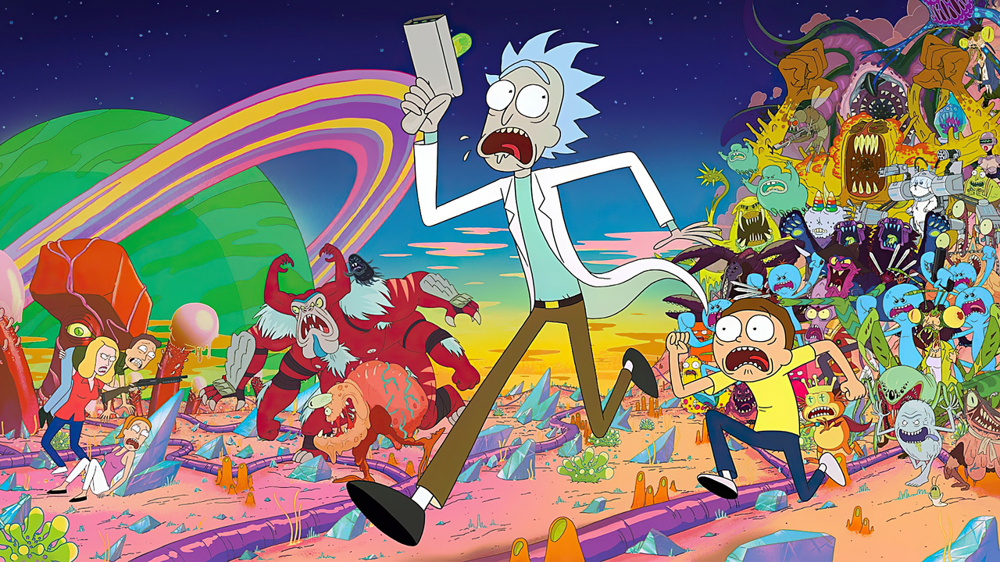

<!DOCTYPE html>
<html lang="en">
<head>
    <meta charset="UTF-8">
    <meta name="viewport" content="width=device-width, initial-scale=1.0">
    <title>Document</title>
</head>
<body>
<h1>Mehmet Adal</h1>
<h2>Hakkımda</h2>

 Merhaba. Ben Mehmet Adal. Ankara'da yaşıyorum. Bilimkurgu,aksiyon,gizem içerikli filmleri izlemeyi seviyorum. Front-end developer olmak istiyorum.
  Kodluyoruz ve patika.academy sayesinde bu eğitimlerle web geliştirmeye ilk adımı atmış oldum.   Teşekkürler Kodluyoruz!

<h2>İlgi Alanlarım</h2>
<ol>1. Film
    <ul>
        <li>
            <a href="https://www.imdb.com/title/tt0816692/?ref_=nv_sr_srsg_0_tt_8_nm_0_q_%25C4%25B1nterste" target="_blank">Interstellar</a>
        </li>
        <li>Inception</li>
        <li>Shutter Island</li>
    </ul>
</ol>
<ol>2. Dizi
    <ul>
        <li>
            <a target="_blank" href="https://www.imdb.com/title/tt5180504/?ref_=tt_mv_close">Witcher</a>
       </li>
        <li>Rick and Morty</li>
        <li>The Last of Us</li>
    </ul>
</ol>
<ol>3. Kitap
    <ul>
        <li>Yorgun Savaşçı</li>
        <li>
            <a href="https://www.goodreads.com/book/show/13169946"  target="_blank">Kumarbaz</a> <!-- Tüm Linkler yeni sekmede açılacak-->
        </li>
        <li>Uçurtma Avcısı</li>
    </ul>
</ol>
<h2>Sevdiğim Diziler</h2>
<h3>Rick and Morty</h3>

    <!--resim boyutu düzenlendi-->
    
Rick and Morty, Justin Roiland ve Dan Harmon tarafından Adult Swim için yaratılan bir yetişkin animasyon televizyon dizisidir.

</body>
</html>

